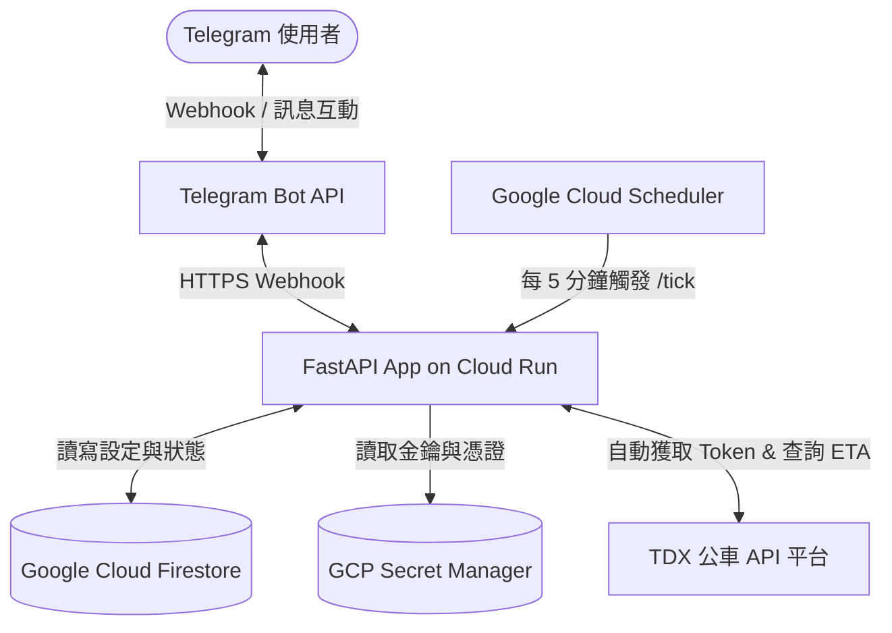

# Tainan Bus Commute Bot (台南公車通勤機器人)

[](https://www.python.org/)
[](https://fastapi.tiangolo.com/)
[](https://cloud.google.com/run)
[](https://cloud.google.com/firestore)
[](LICENSE)

專為台南通勤族設計的 Telegram 公車到站定時自動通知機器人。串接台灣政府 **TDX (Transport Data eXchange)** 公車 API，提供即時、精準的公車預估到站時間（ETA）通知。

---

## 🏗️ 系統架構圖 (System Architecture)



---

## 🛠️ 技術棧 (Tech Stack)

*   **核心語言與框架**：Python 3.13 + [FastAPI](https://fastapi.tiangolo.com/) + Uvicorn
*   **雲端託管平台**：[Google Cloud Run](https://cloud.google.com/run) (無伺服器容器化託管)
*   **資料儲存**：[Google Cloud Firestore](https://cloud.google.com/firestore) (原生模式 NoSQL 資料庫)
*   **定期任務排程**：[Google Cloud Scheduler](https://cloud.google.com/scheduler) (每 5 分鐘打一次 `/tick`)
*   **金鑰與敏感資訊管理**：[Google Cloud Secret Manager](https://cloud.google.com/secret-manager)
*   **外部 API 串接**：台灣交通部 TDX 平台 (公車即時到站資料庫)

---

## ✨ 核心設計與特色 (Core Features)

1.  **TDX Access Token 快取管理**：
    *   TDX 使用 OAuth 2.0 Client Credentials 授權。系統實現了 Token 自適應快取，在過期前（一般為 1 天）直接重用記憶體快取中的 Token，避免高頻重複向 TDX 申請 Token 造成延遲與連線浪費。
2.  **API 呼叫次數深度優化 (Quota Saving)**：
    *   在定時推播與手動「立即推播」時，系統會以**路線 (Route)** 為單位進行快取。同一時段内即使有多名使用者追蹤同一路線的「上班」與「下班」不同方向/不同站點，在同一個 5 分鐘 tick 內也只會呼叫一次 TDX API，大幅減省日均 API 限額。
3.  **Webhook 安全保護機制**：
    *   透過 `TELEGRAM_WEBHOOK_SECRET` 與 `TICK_AUTH_TOKEN` 對外部請求進行簽章驗證，確保只有來自 Telegram 官方的 Webhook 與來自 GCP Scheduler 的 Tick 能調用系統路由。
4.  **容錯與中斷警告 (Fail-Safe)**：
    *   當 TDX API 異常或專案 API 額度用盡時，系統偵測連續失敗達閥值（預設 2 次）後，會向使用者推播「系統/額度異常通知」並暫停當日剩餘推播，避免無限重試干擾使用者與浪費資源。
5.  **雙模式儲存設計 (Store Pattern)**：
    *   提供生產環境的 `FirestoreStore` 以及適用於本地開發及測試環境的 `InMemoryStore`。

---

## 📂 專案結構 (Directory Structure)

```
.
├── app/
│   ├── deps.py          # 依賴注入項目 (Firestore / Telegram / TDX 等客戶端初始化)
│   ├── formatting.py    # 到站時間格式化與中文語義化處理
│   ├── keyboards.py     # Telegram 各式 Reply / Inline 鍵盤設計
│   ├── main.py          # FastAPI App 入口與路由綁定
│   ├── models.py        # Pydantic 數據模型與 Firestore 序列化架構
│   ├── scheduler.py     # 處理 /tick 發送、時段判定與自動推播核心邏輯
│   ├── store.py         # 儲存層抽象類別與具體實作 (Firestore / In-Memory)
│   ├── tdx.py           # TDX API 客戶端實作 (Token 獲取與 ETA 查詢)
│   ├── telegram.py      # Telegram HTTP API 客戶端實作
│   └── timeutil.py      # 時間判斷工具 (處理國定假日與台北時區轉換)
├── docs/                # 設計文檔、部署指南與使用者需求書
├── tests/               # 完整的 Pytest 單元測試與集成測試集
├── deploy_gcp.sh        # 一鍵部署至 GCP 的 Bash 自動化指令碼
├── run_local.sh         # 本地極速啟動腳本
├── requirements.txt     # 生產環境依賴
└── requirements-dev.txt # 本地開發與測試依賴
```

---

## 🚀 本地開發啟動 (Local Development)

### 1. 配置環境變數
請在專案根目錄下建立 `.env` 檔案（或拷貝並修改現有的範本）：
```ini
TELEGRAM_BOT_TOKEN=your_telegram_bot_token
TELEGRAM_WEBHOOK_SECRET=your_custom_webhook_secret_token
TICK_AUTH_TOKEN=your_custom_tick_token

TDX_CLIENT_ID=your_tdx_client_id
TDX_CLIENT_SECRET=your_tdx_client_secret

STORE_TYPE=inmemory # 本地測試使用記憶體，不需配 Firestore
```

### 2. 啟動服務
專案提供一鍵本地運行指令碼，會自動在虛擬環境中安裝依賴並啟動 Uvicorn：
```bash
chmod +x run_local.sh
./run_local.sh
```
服務將預設啟動於 `http://localhost:8000`。

### 3. 執行測試
專案使用 `pytest` 搭配 `respx` 進行 mock 測試，測試覆蓋率高。在本地虛擬環境中直接執行：
```bash
pytest
```

---

## 🌐 部署至 Google Cloud Platform (GCP)

本專案經過深度設計，部署至 GCP 可享用完全無伺服器 (Serverless) 體驗。

### 自動化一鍵部署
專案根目錄提供了一個經過完整封裝的 **`deploy_gcp.sh`** 部署腳本，會自動執行以下任務：
1. 啟用所需的 GCP APIs (`secretmanager`, `run`, `cloudbuild`, `firestore`, `scheduler`)。
2. 建立 Firestore 資料庫（預設於 `asia-east1` 台灣機房）。
3. 將 `.env` 中的金鑰上傳並版本化保存至 **Google Secret Manager**。
4. 設定 Cloud Run 服務帳號權限（Datastore 使用者與 Secret 存取者）。
5. 使用 Cloud Build 自動編譯 Docker 映像檔並部署至 **Cloud Run**。
6. 建立 **Cloud Scheduler** 定期觸發排程（每 5 分鐘打一次 `/tick`）。
7. 自動完成 Telegram Webhook 的網址註冊與祕鑰綁定。

部署前請確保您本地已安裝 `gcloud` CLI 並完成登入，隨後執行：
```bash
chmod +x deploy_gcp.sh
./deploy_gcp.sh
```

---

## 🔒 費用與安全審計 (Cost & Security Audit)

*   **完全免費 ($0/月)**：
    *   **Cloud Run**：每月享 200 萬次免費請求。本專案每天僅進行 288 次自動 tick，佔免費額度 **0.43%**。
    *   **Firestore**：每日免費 5 萬次讀取與 2 萬次寫入，本專案日均讀寫次數小於 500 次。
    *   **Secret Manager**：每月前 6 次主動查詢/呼叫免費，Cloud Run 實例只在冷啟動時載入一次，完全免費。
    *   **Vulnerability Scanning**：預設已關閉，防止產生額外的映像檔掃描費。
*   **資安防護**：
    *   所有敏感憑證皆不進入程式碼或 Git 歷史紀錄，統一採用 Secret Manager 保存，並在 Cloud Run 運行時以環境變數形式動態注入。
    *   嚴格驗證 Telegram Webhook Secret 與 Scheduler Auth Token。
